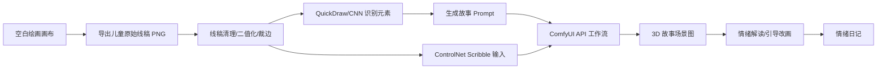
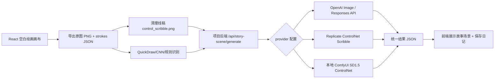

# BreathScape 项目上下文

## 2026-06-21 补充：按 sample 视频重构手势动态

### 参考素材

- 视频：`sample/此天才用Gemini手搓了一个电子花园_此天才用Gemini手搓了一个电子花园_玩了一个晚上做了好几.mp4`
- 时长约 `101.53s`，尺寸 `720 x 960`。
- 已通过 Chrome 读取本地视频并提取：
  - `output/playwright/sample-contact-sheet.jpg`
  - `output/playwright/sample-sequence-blow.jpg`
  - `output/playwright/sample-sequence-finger.jpg`
  - `output/playwright/sample-sequence-palm.jpg`

### 视频交互规律

- 动态反馈围绕手掌、手指和嘴部形成，不是固定铺满整个背景。
- 手指移动留下弧形轨迹，花朵在轨迹端点分批生长。
- 张开手掌时，光线与叶片从掌心径向展开。
- 吹气时，小花、叶片和光点从嘴部附近沿吹气方向扩散。
- 双手拉开时，局部植物群逐渐展开并变大。
- 松手或张开双掌后，元素缓慢淡出，不做瞬间回弹。

### 架构修正

- `StoryCameraController`
  - 除连续环境参数外，新增局部交互输出：
    - 镜像后的手部归一化坐标；
    - 嘴部归一化坐标；
    - 双手距离；
    - 举手状态；
    - 动作能量。
- `StoryDynamicOverlay`
  - 接收 `interaction`，以真实手/嘴位置作为效果锚点。
  - 手移动时保存 2.2 秒轨迹历史。
  - 有花朵场景时沿轨迹长出小花；其他场景使用抽象光点，避免强塞植物。
  - 掌心附近绘制呼吸光环。
  - 举手触发径向叶片与光线展开。
  - 微笑触发分批生长的小花群。
  - 吹气触发局部叶片/花瓣流和弧形气流线。
  - 靠近触发叶片花环和镜头推进。
  - 安静触发低频扩散呼吸环。

### 场景适配

新增 `buildStorySceneProfile(stageJob)`，只依据生成任务的 `recognizedElements` 决定环境元素：

- 识别草地：允许草层，不自动增加树和花。
- 识别花朵：允许花朵、花瓣与手指生花。
- 识别树木：允许树木、树叶和掌心叶片。
- 识别水面：允许涟漪。
- 可判断为户外时才允许云、雨和环境风线。
- 无法判断背景时只保留抽象光点与局部手势反馈。

因此静态树木、花丛不会再强制出现在每一张背景图上。

### 动作时间轴

- 调试按钮不再直接切换持久参数。
- 每次点击创建一个带 `startedAt` 的动作事件。
- 动作使用缓入、停留、缓出时间包络。
- 吹气持续约 `6.2s`：
  - 0-0.75 秒逐渐起风；
  - 风场约 2.5 秒从左向右传播；
  - 风峰经过后使用低频阻尼回摆；
  - 云、雨和局部粒子随包络逐渐变化；
  - 结束后自然回到摄像头连续控制。
- 举手、微笑、细雨、安静和靠近分别使用 4.2-6.8 秒时间轴。
- 当前动作可再次点击取消，也可点击“恢复摄像头控制”提前结束。

### 验证

- 场景配置规则已验证：
  - 未知背景：不添加云雨草花树水面；
  - `grass`：只允许草、户外云雨，不添加树和花；
  - `tree + pond`：允许树、落叶和涟漪，不添加草花。
- 草地场景截图确认不再强制出现程序化树木和花朵：
  - `output/playwright/story-adaptive-grass.png`
- 参考视频式局部效果截图：
  - `output/playwright/story-reference-raise.png`
  - `output/playwright/story-reference-blow-early.png`
  - `output/playwright/story-reference-blow-mid.png`
  - `output/playwright/story-reference-blow-release.png`
  - `output/playwright/story-reference-blow-settled.png`
- 活动页面实测约 `60.27 FPS`。
- `npm.cmd run build` 通过。

## 2026-06-21 补充：摄像头同源动作调试按钮

### 目标

为了在没有真实摄像头或不方便做动作时检查动态元素，故事舞台新增动作调试按钮。调试按钮不是单独的演示动画，而是与 MediaPipe 摄像头识别共用同一套动态控制参数和同一个 `StoryDynamicOverlay` 渲染入口。

### 共享控制参数

新增：

- `src/story-scene/storyMotionControls.js`

统一参数包括：

- `windStrength`：风力；
- `windDirection`：风向；
- `windGust`：阵风强度；
- `cloudAmount`：动态云层数量与浓度；
- `rainAmount`：雨量；
- `sunWarmth`：暖光；
- `sparkleDensity`：光点密度；
- `flowerBloom`：花开与花瓣密度；
- `calmLevel`：整体动画速度；
- `cameraPush`：镜头推进；
- `cameraBreath`：镜头和光线呼吸。

摄像头识别和调试按钮最终都输出上述对象。`StoryDynamicOverlay` 内部统一做指数缓动，因此切换动作时不会硬跳。

### 调试按钮

故事舞台侧栏新增：

- `吹气`
  - 风力和阵风升高；
  - 云量降到接近零；
  - 云快速移出画面；
  - 出现风线；
  - 花瓣快速横向漂移；
  - 花草明显偏摆；
  - 雨停止。
- `举手`
  - 暖光增强；
  - 光点增加；
  - 花朵与花瓣增加；
  - 云量降低。
- `微笑`
  - 暖光、光点、花开提升到高值；
  - 雨停止；
  - 云层变薄。
- `细雨`
  - 云量升高并转为灰蓝乌云；
  - 雨滴数量增加；
  - 暖光和光点降低。
- `安静`
  - 风和阵风降低；
  - 雨停止；
  - 动画速度降低；
  - 镜头呼吸更稳定。
- `靠近`
  - 触发与身体靠近识别相同的镜头推进参数。

本节描述的是第一版参数调试实现，已被上方“按 sample 视频重构手势动态”替代。当前按钮创建局部动作事件，不再持续覆盖整套摄像头参数。

### 动态元素实现

`StoryDynamicOverlay.jsx` 已扩展：

- 动态云由 5 朵增加为 8 朵，并由 `cloudAmount` 控制实际绘制数量和透明度。
- 高云量或降雨时云层使用灰蓝色，形成可吹散的乌云层。
- 新增 18 条程序化风线，由 `windStrength` 和 `windGust` 控制数量、速度和透明度。
- 阵风同时影响云移动速度、花瓣横向漂移和草叶偏摆。
- 所有动态仍只绘制在生成图真实显示区域内。

### 界面

- 新增“动作调试”区和当前模拟状态。
- 六个按钮使用图标加短标签。
- 指标区新增“云量”，便于直接观察吹气和细雨的参数变化。

### 验证结果

- `npm.cmd run build` 通过。
- Playwright 使用正常鼠标交互完成 Mock 绘画、生成、进入故事舞台。
- 六个调试按钮均已点击验证：
  - 举手：风力 `46%`、光点 `86%`、云量 `20%`；
  - 微笑：雨量 `0%`、光点 `100%`、云量 `16%`；
  - 细雨：雨量 `72%`、云量 `94%`；
  - 安静：风力 `8%`、雨量 `0%`；
  - 靠近：镜头推进生效；
  - 吹气：风力 `100%`、雨量 `0%`、云量 `2%`。
- 第一版持续模拟已取消；当前动作按时间轴自然结束，也可通过“恢复摄像头控制”提前结束。
- 细雨与吹气 Canvas 像素对比：
  - 细雨状态深色像素：`30842`；
  - 吹气状态深色像素：`1223`；
  - 乌云深色像素减少：`29619`。
- 吹气状态连续 260ms 动画帧差异：
  - 天空区域变化采样像素：`8185`；
  - 地面区域变化采样像素：`3105`；
  - 说明云/风线与花草/花瓣区域都在持续运动，不是只修改指标数字。
- 移动端 `390 x 844` 检查：
  - 调试区宽度 `336px`，位于 `27px-363px`；
  - 页面无横向滚动；
  - 六个按钮、状态和四项指标均无文字溢出。
- 截图：
  - `output/playwright/story-debug-rain.png`
  - `output/playwright/story-debug-blow.png`
  - `output/playwright/story-debug-mobile-blow.png`

### 动态层可见度与流畅度重构

用户反馈上一版只有乌云明显，花草树木、风雨几乎不可见，且短时调试动作不利于观察。已完成重构：

- 动态树木：
  - 仅在识别结果包含树木/森林/叶片时生成 3 棵前/中景树；
  - 树干、三团树冠和高光冠层分层绘制；
  - 风力与阵风同时控制树干轻摆和树冠偏移。
- 前景草带：
  - 仅在识别结果包含草地/植物时启用，最多 112 根粗细不同的草叶；
  - 默认透明度提高；
  - 风力改变摆动频率，阵风产生明显整体压弯。
- 动态花丛：
  - 新增 32 朵程序化花；
  - 每朵包含弯曲花茎、5 片花瓣和花心；
  - `flowerBloom` 控制实际可见数量；
  - 风力和阵风控制花茎弯曲及花头位移。
- 飘叶与花瓣：
  - 新增 46 片飘叶；
  - 花瓣从 24 增加到 42；
  - 吹气时叶片和花瓣横向加速，形成明确风向。
- 风：
  - 保留 18 条风线；
  - 风线、树冠、草叶、花朵、叶片和花瓣共享同一风参数。
- 雨：
  - 雨线从 72 增加到 180；
  - 提高雨线透明度和线宽；
  - 新增 14 组地面涟漪；
  - 细雨状态同时出现乌云、密集雨线、飘叶和涟漪。
- 性能：
  - Canvas 像素比上限从 2 降为 1.35，减少高 DPI 设备填充压力；
  - 粒子和植被对象在尺寸变化时创建，动画帧内复用；
  - 默认、吹气、细雨状态在桌面 Chrome 实测均约 `60 FPS`。
  - 移动端 `390 x 844`、Canvas `361 x 271` 实测约 `60.5 FPS`，无横向滚动。
- 交互：
  - 该持续状态方案已被动作时间轴替代；
  - 再次点击当前动作可关闭；
  - 新增“恢复摄像头控制”按钮；
  - 动作按缓入、传播、阻尼恢复、淡出的时间轴运行。
- 新截图：
  - `output/playwright/story-dense-default.png`
  - `output/playwright/story-dense-blow.png`
  - `output/playwright/story-dense-rain.png`
  - `output/playwright/story-dense-mobile.png`

## 2026-06-21 补充：故事舞台摄像头识别与动态控制加固

### 修改前仓库状态

- 用户要求修改前确保项目已提交到 `https://github.com/0heng3/breathscape_v3.0`。
- 已执行 `git fetch origin main`。
- 修改前工作区干净，本地 `HEAD` 与 `origin/main` 均为：
  - `a0084c40f045e2c5a5c8e4b6b7410e1362965e1d`
- 本机未安装 GitHub CLI `gh`，但不影响使用 Git 直接核验指定远端与提交一致性。

### 功能审计结论

故事舞台的摄像头识别主链路已经实现，不是占位功能：

- `StoryCameraController.jsx`
  - 浏览器本地加载 MediaPipe Pose、Hand、Face Landmarker。
  - 摄像头视频不上传到故事图片生成 API。
  - 检测结果映射为连续控制参数。
- `StoryDynamicOverlay.jsx`
  - 消费风、雨、暖光、光点、花开和安静度参数。
  - 在生成图真实显示矩形上绘制云、雨、光点、花瓣和草叶。
- `StoryStagePage.jsx`
  - 已有独立大图舞台。
  - 动态 Canvas 与 `object-fit: contain` 后的真实图片区域对齐。

### 本轮完成的加固

- 摄像头模型与媒体流生命周期：
  - 重复开启前先释放旧流和旧模型。
  - 模型全部加载失败时不再错误进入 ready 状态。
  - 开启失败时主动停止已经取得的媒体流。
  - 关闭摄像头时同时停止帧循环、媒体轨道和 MediaPipe 实例。
- 检测循环容错：
  - 单帧 `detectForVideo` 异常不再终止整个 requestAnimationFrame 循环。
  - 连续异常会重置上一帧状态并给出温和恢复提示。
  - 权限拒绝、没有设备、设备占用等预期错误只转为 UI 状态，不再污染控制台 error。
- 动作语义：
  - 双臂展开增强风力。
  - 手部横向移动控制风向。
  - 举手增强暖光、光点和花开。
  - 身体靠近通过肩宽变化估计 `cameraPush`，驱动轻微镜头推进。
  - 平静度生成 `cameraBreath`，驱动舞台和暖光的缓慢呼吸。
- 可观察反馈：
  - 摄像头面板新增“靠近”和“安静”读数。
  - 模型状态根据实际加载成功的姿势、手势、表情模型显示。
  - 对权限、无设备、设备占用和非安全上下文给出不同提示。
- 移动端：
  - 摄像头控制移动到参数列表之前。
  - 故事舞台页面允许内部纵向滚动。
  - 移除移动端面板 `220px` 高度限制，摄像头入口不再被截断。

### 验证结果

- `npm.cmd run build` 通过。
- MediaPipe WASM、Pose、Hand、Face 远程资源均返回 HTTP 200。
- Playwright 使用 Mock provider 完成：
  - 绘画；
  - 生成故事场景；
  - 自动进入故事舞台；
  - 开启摄像头按钮；
  - 无摄像头环境显示“没有找到可用摄像头”；
  - 控制台 0 error / 0 warning。
- 动态 Canvas 像素检查：
  - Canvas 尺寸为 `361 x 271`。
  - 抽样区域有 `28593` 个非透明像素，动态层不是空白。
- 图片与动态层对齐检查：
  - left 误差 `0px`；
  - width 误差 `0px`；
  - height 误差约 `0.00006px`；
  - top 误差约 `0.44px`，属于 CSS transform 动画中的亚像素差。
- 截图：
  - `output/playwright/story-stage-camera-desktop.png`
  - `output/playwright/story-stage-camera-mobile-top.png`
  - `output/playwright/story-stage-camera-mobile-controls.png`

### 遗留边界

- 当前自动化环境没有真实摄像头，因此已验证权限/无设备回退和完整 UI 链路，但尚未在本轮用真实人体画面重新标定动作阈值。
- MediaPipe WASM 和三个模型仍从 CDN / Google Storage 加载。网络受限部署若需要完全离线，应把这些资源放入 `public/mediapipe/` 并改为同源 URL。
- `cameraPush` 目前通过相邻帧肩宽变化估计，真实儿童使用时建议采集一轮样本，再调整灵敏度、稳定窗口和最小置信度。

## 2026-06-21 补充：生成图显示失败与动态舞台页面策略

### 生成图片无法显示的当前判断

用户截图中右侧“故事场景”缩略图区域出现破图图标和 alt 文案，说明前端已经拿到了 `job.imageUrl`，但浏览器无法成功加载该图片资源。当前排查结果：

- 最新生成文件确实存在于项目目录：
  - `E:\breathscape_v3.0\public\generated\story-scene\story-1782035462937-5a2fc7.png`
- API health 正常：
  - `http://127.0.0.1:3008/api/story-scene/health`
  - 返回 provider 列表和 `defaultProvider: newapi`
- 但是访问：
  - `http://127.0.0.1:3008/generated/story-scene/story-1782035462937-5a2fc7.png`
  - `http://127.0.0.1:5173/generated/story-scene/story-1782035462937-5a2fc7.png`
  都返回 404。

优先怀疑原因：

- `server/src/storyScene/fileUtils.js` 写文件时使用 `process.cwd()`，当服务从 `E:\breathscape_v3.0` 启动时，图片写入 `E:\breathscape_v3.0\public\generated\story-scene`，这是正确的。
- `server/src/index.js` 的静态服务路径当前通过 `path.resolve(__dirname, '..', '..', '..')` 计算项目根目录。`__dirname` 是 `E:\breathscape_v3.0\server\src`，向上三级会到 `E:\`，导致 express 静态服务可能指向 `E:\public\generated`，而不是 `E:\breathscape_v3.0\public\generated`。
- 因此图片生成成功，但静态服务目录和写入目录不一致，造成前端破图。

后续修复方向：

- 将 `server/src/index.js` 的 `projectRoot` 改为与 `fileUtils.getProjectRoot()` 一致，优先使用 `process.cwd()`。
- 或把 `getProjectRoot()` 抽成唯一工具函数，由上传目录、生成目录、静态目录全部复用，避免再次出现写入路径和访问路径不一致。
- 同时保留前端 `normalizeImageUrl()` 的直连逻辑，以兼容 `5173` dev server、`4173` preview server 和 API server 的不同打开方式。

### 右下角小方框不适合作为最终动态舞台

当前右侧小方框更适合做“生成结果缩略预览”，不适合承载后续动态元素系统。原因：

- 缩略图尺寸太小，无法准确检查生成图布局、主体是否裁切、天空/地面留白是否足够。
- 后续要添加云、风、雨、花草、光点、树叶、表情/姿势驱动动画，必须在和最终显示一致的画布尺寸上对齐。
- 如果只在小方框上叠动态元素，后续切到大图时会遇到坐标缩放、裁切、object-fit、滚动容器、设备像素比等问题。
- 小方框可以保留为 before/after 对比，但不应该作为交互动效编辑或体验区域。

### 推荐页面结构

建议把流程拆成两个阶段页面，而不是把所有功能塞在右侧面板：

1. **绘画生成页 `/story-scene`**
   - 左侧大画布：儿童绘画。
   - 右侧面板：provider、风格、情绪、识别线索、原图/结果缩略图、生成按钮。
   - 生成成功后显示“进入故事场景”或自动切换到结果舞台。

2. **故事舞台页 `/story-scene/play/:jobId` 或 `/story-scene/stage/:jobId`**
   - 生成图作为主视觉，居中大尺寸显示。
   - 上方叠加透明 Three.js / Canvas / DOM 动画层。
   - 动态元素、摄像头表情/姿势控制、呼吸光效、雨云风花草都在该页面运行。
   - 页面可提供轻量控制：重生成、换风格、保存日记、开启摄像头、退出。

如果暂时不新增路由，也可以在同一页做“绘画模式 / 故事模式”切换：生成成功后主画布区域从绘画 canvas 切换为生成图舞台。但从架构清晰度和后续扩展看，新开舞台页更干净。

### 动态元素对齐策略

动态元素必须和生成图使用同一套坐标系统，不能依赖 DOM 视觉猜测。

推荐坐标规范：

- 以生成图自然尺寸为基准，例如 `1024 x 1024`。
- 所有动态元素保存为归一化坐标：
  - `x: 0..1`
  - `y: 0..1`
  - `scale`
  - `layer: sky | background | midground | foreground | ground`
  - `anchor: center | bottom | top`
- 渲染时根据图片实际显示矩形计算：
  - `displayX = imageRect.left + x * imageRect.width`
  - `displayY = imageRect.top + y * imageRect.height`
- 如果使用 `object-fit: contain`，需要计算 letterbox 留白，只在真实图片显示区域内叠加元素。
- 动态层 canvas/WebGL 的 CSS 尺寸必须与图片显示区域完全一致，而不是与外层容器一致。

进阶对齐：

- 生成图完成后做一次区域分析，得到：
  - 天空 mask；
  - 地面 mask；
  - 树/房子/主体 mask；
  - 可遮挡区域；
  - 不可遮挡主体区域。
- 初期可以用规则估计：上 40% 作为天空，下 60% 作为地面。
- 稳定后再接入 vision 模型或轻量分割模型生成 mask。mask 与 `jobId` 一起保存，避免每次打开重复计算。

### 动态系统和摄像头控制的关系

摄像头不直接“生成新图”，只输出控制参数。动态系统根据参数驱动动画：

- `windStrength` 控制草、花、树叶、云的速度和摆幅。
- `rainAmount` 控制雨滴数量、云层透明度、地面涟漪。
- `sunWarmth` 控制暖光、光束、花朵亮度。
- `sparkleDensity` 控制光点、萤火、魔法粒子。
- `calmLevel` 控制整体动画速度、镜头呼吸和颜色稳定度。

面部表情和姿势检测结果必须做平滑：

- 使用 1-3 秒时间窗口。
- 只在置信度稳定时改变情绪参数。
- 用 lerp 缓动，避免儿童一动表情就让画面突然跳变。
- 交互反馈使用隐喻表达，不直接给儿童贴“生气/害怕”等标签。

### 当前建议

- 先修复图片静态服务路径，保证生成图能稳定显示。
- 然后新增或切换到“大图故事舞台”视图，不要把右侧小方框作为最终动态区域。
- 动态元素优先使用本地素材库和程序化动画，API 只用于生成底图和离线素材包。
- 后续摄像头接入应控制动画参数，而不是频繁重新生成图像。

## 2026-06-21 补充：故事场景 API 模型与后续动态层策略

### NewAPI / Yunwu 模型结论

- 当前项目的故事场景生成主链路是：儿童在空白画布上自由绘画 -> 点击生成 -> 后端把整张草图作为 `image` 提交到 OpenAI-compatible 图片编辑接口 -> 返回一张完整 3D / 水彩故事场景底图。
- NewAPI 模型列表中可用图片相关模型包括：`gpt-image-1`、`gpt-image-1.5`、`gpt-image-2`、`gpt-image-2-pro`、Gemini image 系列、Seedream 系列、MJ 系列等。
- 实测同一张测试草图走 NewAPI `/v1/images/edits`：
  - `gpt-image-2` 成功返回 `b64_json`，并生成完整故事花园图。
  - `gpt-image-1`、`gpt-image-1.5`、`gpt-image-2-pro` 对同一输入返回“image data invalid”或接口不稳定。
  - Gemini image 系列在当前 multipart edit 接口上返回 EOF 类错误。
  - Seedream 返回非标准/异步结果，不适合直接接入当前同步图片编辑链路。
- 因此当前推荐默认模型为 `gpt-image-2`。`.env` 已设置：
  - `STORY_SCENE_PROVIDER=newapi`
  - `NEWAPI_IMAGE_MODEL=gpt-image-2`
  - `YUNWU_IMAGE_MODEL=gpt-image-2`
- Yunwu 已接入为 OpenAI-compatible provider，密钥从 `D:\yuxin\code\secrets_local.py` 读取。当前 Yunwu 图片编辑接口可鉴权、模型列表可访问，但图片生成测试返回 `429 当前分组上游负载已饱和`，因此保留为备用 provider。

### 生成底图的布局要求

为了后续在生成图之上叠加动态元素，底图不能只是“好看插画”，还必须是“可动画化舞台”。当前 prompt 已加入以下约束：

- 生成一张完整、统一、非贴纸感的故事场景。
- 主体不要裁切，不要贴边，不要极近景。
- 保持地平线、地面和空间层次可读。
- 需要前景、中景、背景三层关系。
- 天空和地面要保留干净开放区域，方便后续叠加云、雨、光点、花瓣、花草摆动、路径粒子等动态层。
- 避免杂乱背景、孤立物体、贴纸集合、过强透视。
- app 结果预览缩略图使用 `object-fit: contain`，避免界面显示时误裁切生成图。

### 后续动态元素是否必须再用 API 生成

不建议每次交互都调用 API 生成动态元素。更自然、实时、成本可控的方案是“三层混合架构”：

1. **API 生成底图**
   - 用 `gpt-image-2` 生成完整故事场景底图。
   - 底图负责整体风格、光照、空间、故事气氛。
   - 生成后保存原始草图、底图、prompt、provider、模型、识别线索，便于复现和日记归档。

2. **预制/半自动生成动态素材库**
   - 花草树木、云、雨、风线、光点、蝴蝶、星星、花瓣等动态元素不应每帧 API 生成。
   - 优先使用项目已有 `fig` 素材、透明 PNG sprite、程序化粒子、Three.js billboard、CSS/canvas 粒子。
   - 对缺少的元素，可以离线或一次性用 API 生成一批透明背景素材包，例如多种云朵、小花、小草、树叶、花瓣、雨滴、风线、萤火、光斑。
   - 这些素材进入本地资产库后，运行时只做摆动、漂移、缩放、透明度、粒子发射，不再频繁调 API。

3. **实时动态叠加与交互控制**
   - 在生成底图上方叠加一个透明 Three.js / Canvas / DOM 动画层。
   - 动态层根据底图布局进行区域分配：
     - 天空区域：云漂移、雨、雪、光束、星星。
     - 地面区域：花草摇摆、花瓣、脚印/路径粒子。
     - 树木/房屋附近：叶片轻摆、窗光、蝴蝶、萤火。
   - 初期不做复杂图像分割也可以工作：用固定规则把画面上 35%-45% 作为天空、下 55%-65% 作为地面，中间作为远景。
   - 更自然的进阶方案是生成后做一次轻量视觉分析/分割：判断天空、地面、树、房子、花丛的大致区域，输出可动画区域 mask，让动态元素只在对应区域内出现。

### 表情与姿势驱动的交互策略

可以打开摄像头，使用本地实时检测控制画面动态，不建议把摄像头视频发给图像生成 API。推荐本地检测：

- **姿势检测**
  - 继续复用现有 `@mediapipe/tasks-vision` / Pose Landmarker。
  - 手臂张开：风变大、云移动变快、花草摆动增强。
  - 手举高：阳光增强、光点上升。
  - 身体前倾：镜头轻微推进、前景花草放大。
  - 身体稳定：画面逐渐安静、雨停、光线柔和。

- **面部表情检测**
  - 可使用 MediaPipe Face Landmarker / Blendshapes 或浏览器端轻量表情模型。
  - 微笑/开心：阳光、花开、蝴蝶、暖色光点增加。
  - 难过：细雨、蓝色柔光、云层变厚，但保持安全、温柔。
  - 生气：风更强、草木摆动更明显，再逐渐引导平复。
  - 害怕/紧张：场景降低刺激，出现温暖灯光、保护性小屋/树荫、慢速呼吸光圈。
  - 平静：动画低频、云慢、花草轻摆。

- **自然度关键**
  - 表情和姿势不要直接硬切动画状态，而是映射到连续参数：`windStrength`、`sunWarmth`、`rainAmount`、`flowerBloom`、`sparkleDensity`、`cameraBreath`、`calmLevel`。
  - 所有参数使用缓动滤波，例如 0.1-0.2 的 lerp，避免画面突然跳变。
  - 儿童表情识别可能不稳定，需要用 1-3 秒窗口做平滑和置信度门槛。
  - 动态反馈要“情绪陪伴”，不是“情绪评判”：UI 文案和动画都避免直接说“你生气了/你害怕了”，而是让画面自然变成风、雨、光、花开的隐喻。

### 推荐实现路线（暂不执行）

1. **阶段一：生成底图 + 静态动态层**
   - 使用 `gpt-image-2` 生成底图。
   - 在底图上方加透明动画层。
   - 先用规则区域放置云、雨、光点、花瓣、花草摆动。
   - 不接摄像头，只用按钮/滑杆调试自然度。

2. **阶段二：底图区域识别**
   - 对生成底图做一次区域分析，得到天空/地面/主体/可遮挡区域。
   - 动态元素根据 mask 出现，减少违和感。
   - 保存 mask 到日记数据，避免每次打开都重新分析。

3. **阶段三：摄像头驱动**
   - 接入本地 Pose + Face Landmarker。
   - 输出连续情绪/姿势参数，不直接操作具体元素。
   - 动画系统订阅这些参数，控制风、云、雨、光、花草、镜头呼吸。

4. **阶段四：个性化素材补全**
   - 针对底图风格，用 API 批量生成透明素材包。
   - 素材只在保存/换主题时生成，不在实时交互中生成。
   - 素材库按主题、情绪、元素类型、层级、适合区域索引。

### 当前判断

- 动态元素不应主要依赖实时 API 生成；实时 API 会慢、贵、不稳定，也很难交互。
- API 最适合生成“统一风格底图”和“离线素材包”。
- 实时自然交互应由本地动画系统完成，摄像头只提供情绪/姿势参数。
- 对本项目来说，`gpt-image-2` 当前最适合作为底图生成模型；后续动态自然度的核心在于布局 prompt、区域 mask、素材库和参数平滑，而不是不断重新生成图片。

> 维护规则：每次对话结束前都要同步更新本文件，记录本轮读到的项目事实、已完成改动、验证结果、遗留问题和下一步建议。

更新时间：2026-06-21

## 项目当前定位

BreathScape 是一个面向儿童情绪表达的 Web Demo。当前产品流程按 `fig/plan.png` 重构为：

1. 情绪触发。
2. 选择并进入花园。
3. 选择元素。
4. 开始绘画。
5. 对应生成/优化画面。
6. 识别画面并进行情绪解读。
7. 引导改画（语音 + 手势交互）。
8. 输出画面优化结果。
9. 整理为情绪日记。

当前应用是 Vite + React 项目，主流程集中在 `src/App.jsx`，场景视觉集中在 `src/components/GardenStage.jsx`、`src/components/ThreeBillboardGarden.jsx`、`src/data/figSpriteAssets.js` 和 `src/styles/global.css`。

GitHub 远程仓库已指向：

```text
https://github.com/0heng3/breathscape_v3.0.git
```

运行代码和文档中未发现仍引用旧 GitHub 2.0 仓库路径；仅 `log_83.txt`、`log_96.txt` 这类历史日志里保留了 `E:\breathscape_v2.0\public\quickdraw-cnn` 输出记录，未改写历史日志。

## 已有核心能力

### 实时绘画与反馈

- `DrawingCanvas.jsx` 采集 pointer 笔触。
- `App.jsx` 在停笔后调用识别与规则逻辑，更新 `sceneState`。
- `GardenStage.jsx` 根据 `elementHistory` 和 `liveResponses` 渲染花园元素。
- `audioEngine.js` 已有元素声音反馈和实时声音触发能力。
- QuickDraw 模型、模板和 CNN 资源已接入，用于停笔后的绘画识别。

### 安放与姿态控制

- `BreathePage.jsx` 负责呼吸安放流程。
- `PoseSettleStage.jsx` 使用 `@mediapipe/tasks-vision` 的 Pose Landmarker 读取身体关键点。
- `applyGestureSettling` 会根据姿态更新 `calmLevel`、`windEnergy`、`sunlightWarmth`、`gestureWind`、`gestureGlow` 等场景变量。
- `GardenStage.jsx` 和 `ThreeBillboardGarden.jsx` 会使用这些变量驱动云、风、灯光、柔化、相机轻微运动和公告板植物摆动。

## 新素材目录 `fig`

源目录：`E:\breathscape_v3.0\fig`

| 文件 | 尺寸 | 观察 | 推荐用途 |
|---|---:|---|---|
| `背景1.jpg` | 1419 x 1063 | 完整水彩远景：天空、山坡、草地、边缘植物，中心留白充足 | 作为花园远景底图或 2.5D 背景层 |
| `云.png` | 1570 x 1003 | 多个云朵素材排版在白底图集上，无 alpha 通道 | 裁切为透明云 sprite 后用于天空 billboards |
| `草.png` | 1653 x 1045 | 多个草丛/小花草素材排版在白底图集上，无 alpha 通道 | 裁切为透明草丛 sprite 后插入地面层 |
| `花.png` | 1147 x 937 | 多个花朵素材排版在白底图集上，无 alpha 通道 | 裁切为透明花朵 sprite 后用于前中景 |
| `plan.png` | 659 x 677 | 流程说明图，文字为“情绪触发、选择并进入花园、选择元素、开始绘画、对应的优化画面、识别画面→情绪解读、引导改画（语音+手势交互）、画面优化结果、整理为情绪日记” | 已转化为画布页流程 HUD 的信息架构参考 |
| `贴图实现3D效果示例.mp4` | 720 x 938, 约 103 秒 | 参考效果是 2D 贴图分层、透视地面、多层 billboard、风动/漂浮，而不是复杂 3D 模型 | 作为视觉方向参考，保留在源素材目录，不放入 `public` 发布包 |

重要发现：`云.png`、`草.png`、`花.png` 是 24-bit RGB，没有透明通道。直接用 CSS 图集裁剪会露出白色矩形边界，即使用 `mix-blend-mode: multiply` 也不够干净。因此运行时使用裁切后的透明 PNG sprite。

## 参考项目 `E:\3D_v1` 技术路线分析

`E:\3D_v1` 是已实现的部分复刻项目，核心价值在于视频同款技术骨架：

- Three.js `PerspectiveCamera` + 低角度透视，形成手机端 3D 花田视角。
- `InstancedMesh` 承载大量花、草、树、云公告板。
- `onBeforeCompile` 改写顶点着色器，在视图空间展开平面，使植物始终面向镜头。
- 风摆只作用在花草顶点上，树和云不做同等幅度摆动。
- 透视棋盘格地面由 CanvasTexture 平铺生成。
- UI 是半透明玻璃面板，包含素材、摆放、设置等分区。

本项目采用“嵌入式迁移”而不是完全替换：保留现有 React 绘画识别/情绪日记流程，将 `E:\3D_v1` 的 Three.js 公告板场景压缩为 React 组件，作为花园画布动态底座。

## 本轮实现：动态 Three.js 公告板花园

目标：继续模仿 `贴图实现3D效果示例.mp4` 的动态交互效果，并按 `plan.png` 的流程重构画布页。

### 新增 Three.js 底座

新增文件：

- `src/components/ThreeBillboardGarden.jsx`

实现内容：

- 使用 `three` 创建透明 WebGL 画布，铺在 `GardenStage` 内部。
- 程序化生成水彩风透明贴图：
  - 花。
  - 草。
  - 树。
  - 云。
  - 蝴蝶。
- 用 `InstancedMesh` 建立公告板层，每个贴图一个实例层。
- 通过 `onBeforeCompile` 改写顶点投影，使贴图在视图空间展开，始终面向镜头。
- 顶点着色器根据 `uTime`、`uWind`、`uSway` 做顶部风摆。
- 透视棋盘地面使用 CanvasTexture 平铺生成。
- 相机自动缓慢环绕，同时响应画布区域 pointer 位置做轻微 parallax。
- 场景由现有 `sceneState` 驱动：
  - `grassCoverage` / `growthLevel` 增加草层密度。
  - `flowerBloom` / `flowerCount` 增加花层密度。
  - `windEnergy` / `gestureWind` 增强风摆和相机运动。
  - `sunlightWarmth` / `nightSparkle` / `brightness` 调整曝光与氛围。
  - `elementHistory` 最近元素会映射为 3D 空间中的附加花、草、云或光点。
- WebGL 层设置 `pointer-events: none`，不阻挡绘画 canvas。

## 本轮修正：增强动态交互与识别结果水彩化

用户反馈：当前实现“画面只能小幅度摆动”，且绘画识别成功后的元素仍是旧 SVG/CSS 风格，和水彩 2.5D/3D 场景突兀。

### 动态交互调整

- `ThreeBillboardGarden.jsx`
  - 相机环绕速度与幅度增强：从轻微 parallax 改为更明显的低角度环绕。
  - 增加拖拽视角：在不阻塞绘画 canvas 的前提下，通过父级 capture 监听 pointer 事件，拖动时累积 orbit / tilt。
  - 风摆幅度增强：顶点着色器中的 `wave` 振幅和频率提高，花草立牌更接近 `E:\3D_v1` 的风吹效果。
  - 减少默认底座花草密度，避免 3D 底座与识别后生成元素叠得太厚。
  - Three.js 层改为优先加载 `public/fig/sprites/*.png` 的真实裁切水彩贴图，而不是主要依赖程序化临时花草云。
- `global.css`
  - 降低 CSS 2.5D 静态层透明度。
  - 提高 Three.js 动态层可见度，让视频式 3D 空间感更明确。

### 附图素材扩展

`scripts/extractFigSprites.ps1` 已从 `草.png`、`花.png`、`云.png` 扩展裁切：

- `cloud-1.png` ~ `cloud-16.png`
- `grass-1.png` ~ `grass-25.png`
- `flower-1.png` ~ `flower-20.png`

运行时水彩 sprite 总数：61 张。

新增数据模块：

- `src/data/figSpriteAssets.js`
  - 定义 sprite 数量与路径池。
  - 定义工具 ID 到水彩素材族的映射：
    - `flower / firstFlower / bud / quietFlower / mushroom` → `flower`
    - `cloud / wind / windLine / softWind / ribbon / floatingLeaf / rainbow` → `cloud`
    - 其他地面生长类默认 → `grass`
  - 根据工具和强度返回适配尺寸。

### 识别成功后的元素渲染

`GardenStage.jsx` 与 `ThreeBillboardGarden.jsx` 已继续调整：

- 绘画识别流程不变：`DrawingCanvas → App.finalizePendingDrawing → resolveDrawingTool → buildStampPlacements → elementHistory → GardenStage`。
- 识别结果仍保留 2D 画布坐标，因此不影响 QuickDraw/CNN/规则识别。
- 完成态渲染改为：
  - `GardenStage.jsx` 不再把 `elementHistory` 渲染成 DOM `.watercolor-response` 或旧 `.response-cluster`。
  - `.breathscape-element-layer` 只保留 `liveResponses`，用于绘画过程中的临时反馈。
  - `ThreeBillboardGarden.jsx` 接管完成态 `elementHistory`，把识别结果转成 2.5D/3D 空间中的 billboard 小簇。
- 新的“识别成功后添加元素”路径：
  - 2D 坐标保留为识别与意图来源。
  - 地面类工具按笔触坐标映射到透视地面 `(x,z)`，远处横向范围更窄、近处更宽。
  - 花、草、种子等不是单个屏幕贴片，而是 2 到 8 个真实裁切水彩 sprite 组成的自然小簇。
  - 云、风、光点等天空类工具映射到较高 `y` 和靠后的 `z`，形成漂浮层。
  - 每个完成态元素使用 `id/sourceStrokeId` 做 deterministic seed，重播种时位置稳定，不会随机跳动。

### 2.5D/3D 与绘画识别如何共存

当前架构中识别不依赖 3D 空间：

1. `DrawingCanvas` 始终是顶层真实交互 canvas，记录屏幕/舞台局部 2D 坐标。
2. WebGL/2.5D 视觉层设置 `pointer-events: none`，只负责展示，不抢绘画事件。
3. 停笔后 `App.jsx` 使用 2D stroke 数据做 QuickDraw/CNN/规则识别。
4. `buildStampPlacements` 用 2D 画布坐标决定元素应出现的位置。
5. 渲染时再做两种映射：
   - 过程反馈：2D 坐标 → DOM live feedback。
   - 完成结果：2D 坐标归一化 → Three.js 世界坐标 `(x,y,z)`，成为 billboard 小簇。

因此 2.5D/3D 不会破坏识别；真正要注意的是交互层级和坐标映射。当前应保持“识别在 2D，表现可 2.5D/3D”的架构，而不是直接让用户在 WebGL 场景中画线。

### 绘画与视角控制共存

本轮参考 `E:\3D_v1` 的交互拆分方式继续修正：

- 普通左键/触控拖动仍然只用于 `DrawingCanvas` 绘画。
- 右键、中键、`Shift + 拖拽`、`Alt + 拖拽` 交给 Three.js 场景旋转/俯仰，不再触发绘画。
- `ThreeBillboardGarden.jsx` 在父级 capture 阶段只记录这些旋转手势，普通绘画手势不会累积 orbit/tilt。
- `DrawingCanvas.jsx` 遇到旋转手势会直接 return，不 `preventDefault`、不 setPointerCapture、不开启 stroke。
- 右键菜单在画布区域被阻止，保证右键拖拽可作为视角控制。
- 继续补充 `Shift/Alt + 鼠标滚轮`：用于镜头距离与轻微俯仰调整，不参与绘画。

### 本轮继续修正：Raycaster 安放与自然贴画

用户再次反馈“还是很奇怪”，核心原因是上一版虽然去掉了 DOM 完成态贴图，但 `elementHistory` 到 3D 的位置仍主要是百分比线性换算，不是真正落入当前相机视角下的 2.5D 空间。

参考 `E:\3D_v1` 后，本轮把完成态元素安放改为：

- `ThreeBillboardGarden.jsx` 增加 `THREE.Raycaster`、`THREE.Vector2` 和天空平面。
- 地面类工具使用 `raycaster.setFromCamera(ndc, camera)` 后 `intersectObject(ground)`，命中 Three.js 地面 mesh 后再转回 world/local 坐标。
- 天空类工具不打地面，而是打一个水平天空平面，避免云和风线被压到地表。
- 每个完成态元素以 `id/sourceStrokeId` 缓存第一次计算出的 3D 点，后续 sceneState 重播种不会因为相机已经移动而跳位。
- 如果射线没有命中，才回退到旧的百分比透视换算。
- 花类生成时自动补少量草底座，强化“插在花园里”的贴画/立牌感，而不是裸贴图悬在画面上。
- 完成态 DOM 仍保持 0 个 `.watercolor-response` 和 0 个 `.response-cluster:not(.live-response)`；真实结果在 Three.js billboard 层中。

### 本轮继续修正：空白初始花园与模式分离

用户反馈：从绘画完成到贴图生成会突然一闪，不知道生成元素在哪里；初始画面不应自带花草；鼠标绘画和角度旋转必须分开。

本轮实现：

- `CanvasPage.jsx`
  - 新增显式模式切换：`绘画` / `旋转`。
  - 默认进入 `绘画` 模式。
  - `绘画` 模式下左键/触控只进入 `DrawingCanvas` 画线。
  - `旋转` 模式下绘画 canvas inactive，左键拖拽控制 Three.js 视角。
  - 画布底部提示文案随模式切换。
- `DrawingCanvas.jsx`
  - 增加 `active` 参数。
  - 当 `active=false` 时不开始 stroke，并通过 `data-active="false"` 配合 CSS 禁用 pointer。
- `GardenStage.jsx`
  - 增加 `interactionMode` 与 `handDrawOnly` 参数。
  - 画布页使用 `handDrawOnly`，不再渲染预置 CSS 水彩云、草、花。
  - live feedback 中新增 `placementPreview`，绘画时只显示一个小定位圈，提示元素将落在哪里。
- `ThreeBillboardGarden.jsx`
  - `handDrawOnly=true` 时环境自动花草、树、云、蝴蝶计数全部为 0，只保留地面和用户绘画生成的元素。
  - 旋转手势由 `interactionMode === 'view'` 明确控制，不再依赖隐式 Shift 才能操作。
  - 生成元素增加 1 秒左右的 grow-in 入场缩放。
  - 地面元素生成时出现短暂金色落点光圈，随后淡出。

当前位置确认方式：

1. 绘画过程中，`App.handleStrokeMove` 把当前笔触点写入 `liveResponses` 的 `placementPreview`。
2. `GardenStage.ResponseCluster` 将 `placementPreview` 渲染为定位圈。
3. 停笔识别后，`elementHistory` 使用同一套 `x/y/canvasWidth/canvasHeight` 输入。
4. `ThreeBillboardGarden.raycastScenePointFromStroke` 把该 2D 点转成 NDC，再从当前相机发射 ray。
5. 地面工具命中 ground mesh；天空工具命中 sky plane。
6. 生成的 billboard 小簇与落点光圈使用该命中点作为中心。

### 本轮继续修正：绘画冻结视角、滚轮缩放、清理旧背景

用户反馈：绘画时鼠标仍会影响画面；需要支持鼠标滚轮放大/缩小；画布中仍能看到隐藏/残留背景，需要参考 `E:\3D_v1` 的旋转交互继续完善。

本轮实现：

- `DrawingCanvas.jsx`
  - 绘画模式只接受左键/触控绘画。
  - 不再因为 `Shift/Alt` 放弃绘画，避免隐式快捷键和绘画行为混在一起。
- `ThreeBillboardGarden.jsx`
  - `pointermove` 只有在 `interactionMode === 'view'` 时才更新 `pointerRef`。
  - 绘画模式下相机不再读取鼠标位置，不再自动环绕，不再做 parallax。
  - 切回绘画模式时清空 pointer 输入并停止拖拽状态，保持当前视角稳定。
  - 旋转模式下左键拖拽控制 orbit / tilt。
  - 旋转模式下鼠标滚轮控制 zoom；绘画模式下滚轮不改变 3D 视角。
  - 滚轮缩放只改变镜头距离，不再顺带改变俯仰，交互更接近 `E:\3D_v1` 的 OrbitControls 分工。
- `global.css`
  - `.garden-stage.hand-draw-only` 下隐藏旧 CSS 背景/装饰层：
    - `.paper-grain`
    - `.sky-wash`
    - `.distant-hills`
    - `.moving-clouds`
    - `.garden-map`
    - `.soil-wetness`
    - `.gesture-wind-ribbon`
    - `.lamp-aura`
  - `.watercolor-3d-layer` 在 hand-draw-only 下透明，避免旧水彩背景压在 3D 画布后面。
  - `.three-billboard-garden` 在 hand-draw-only 下改为 `opacity: 1`、`mix-blend-mode: normal`、无额外滤镜，保证画面干净。

### 接入现有花园

修改文件：

- `src/components/GardenStage.jsx`
  - 引入并渲染 `ThreeBillboardGarden`。
  - 保留原有 CSS `Watercolor3DLayer`，形成“水彩底图 + CSS 2.5D + Three.js 动态公告板 + 绘画 canvas”的层级。
  - 完成态识别元素不再渲染为 DOM 屏幕贴图，只保留 live feedback。
  - 画布页 `handDrawOnly` 模式不渲染预置 CSS 云草花。
- `src/components/DrawingCanvas.jsx`
  - 右键、中键、`Shift`、`Alt` 手势让出给场景旋转。
  - 阻止画布右键菜单，避免干扰视角拖拽。
  - 新增 `active=false` 时完全停止绘画输入。
  - 当前最新逻辑：绘画模式由 `active` 控制；绘画层只排除非左键，`Shift/Alt` 不再作为隐式旋转快捷键。
- `src/components/ThreeBillboardGarden.jsx`
  - 增加旋转手势状态 `dragRef`，拖拽时累积 orbit / tilt。
  - 将 `elementHistory` 转为 3D billboard 小簇，按工具类型映射到地面或天空。
  - 新增 Raycaster 安放：地面元素射线命中地面 mesh，天空元素命中天空平面。
  - 新增 `historyPlacementCache`，保证完成态贴画不会随相机重算而漂移。
  - 新增 `Shift/Alt + wheel` 镜头距离和俯仰控制。
  - 新增手绘-only 空白初始场景和生成入场缩放/落点光圈。
  - 当前最新逻辑：旋转/缩放只在 `interactionMode === 'view'` 时启用；绘画模式冻结相机鼠标输入。
  - 清理 `BillboardSystem.clearAll()` 的纹理释放逻辑，只释放实例 geometry/material，不销毁共享 sprite texture。
- `src/routes/CanvasPage.jsx`
  - 新增 `绘画 / 旋转` 模式开关。
- `src/styles/global.css`
  - 新增 `.three-billboard-garden`。
  - 新增 `.garden-flow-panel`。
  - 新增 `.canvas-mode-switch` 与 `.placement-preview`。
  - 新增 hand-draw-only 背景清理规则，隐藏旧 CSS 场景层。
  - `.watercolor-response` 为前一轮 DOM 贴图方案遗留样式；当前完成态不再使用它，后续可清理。
  - 追加画布页视频风格布局覆盖：沉浸式画布、底部横向工具条、右侧轻玻璃反馈面板、移动端纵向堆叠。
- `src/routes/CanvasPage.jsx`
  - 重写为 UTF-8 中文。
  - 增加基于 `plan.png` 的流程 HUD：`选择元素 → 开始绘画 → 识别画面 → 引导改画 → 情绪日记`。
  - 保留原有绘画、识别、反馈、安放入口逻辑。
- `package.json` / `package-lock.json`
  - 新增运行依赖 `three`。
- `src/data/figSpriteAssets.js`
  - 新增水彩 sprite 池和工具映射。

### 旧 2.5D 贴图层保留

上一轮已完成内容继续保留：

- `Watercolor3DLayer` 使用 `背景1.jpg` 作为远景背景。
- 通过 `scripts/extractFigSprites.ps1` 将 `云.png`、`草.png`、`花.png` 裁切为透明 PNG。
- 运行时素材位于 `public/fig/` 和 `public/fig/sprites/`。
- `贴图实现3D效果示例.mp4` 不放入 `public`，避免发布包增加约 38MB。

## 当前视觉分层

1. 远景水彩背景：`背景1.jpg`。
2. CSS 2.5D 层：远景、少量云草花 sprite 与透视地面，作为柔和背景。
3. Three.js 动态层：真实裁切水彩 sprite 的透视棋盘地面、树林、花草、云、蝴蝶、自动相机环绕、拖拽视角和风摆。
4. 绘画层：`DrawingCanvas`，保持最高可交互层。
5. 反馈/UI 层：live feedback、流程 HUD、声音提示、右侧识别反馈和工具条；完成态识别结果进入 Three.js 动态层。

## 新方向方案：手绘简笔画生成 3D 故事场景图

### 用户新想法

新的产品方向是：

1. 儿童先在空白画布上自由绘画。
2. 绘画过程中不急于把每一笔转换为花草贴图。
3. 儿童确认画完后点击一个按钮，例如“生成故事场景”。
4. 系统把整张手绘简笔画美化为一张统一风格的 3D / 2.5D 故事场景图。
5. 之后再做情绪解读、引导改画、情绪日记整理。

这条路线与当前“每笔识别后播种 billboard 元素”的路线不同：它更像“草图到完整插画”的生成式流程，适合输出一张完整的故事场景结果图。

### 是否需要接入图生图模型

结论：需要，但不应只用普通 img2img。

普通 img2img 会把整张儿童画当成低质量参考图去重绘，容易出现：

- 原始构图被改乱。
- 儿童画的重要线条被忽略。
- 生成结果和孩子画的关系变弱。
- 同一个输入多次生成位置漂移。

更合适的技术路线是：

- **草图/线稿控制模型**：ControlNet Scribble / Lineart / SoftEdge。
- **图生图模型**：Stable Diffusion img2img 或 ControlNet pipeline。
- **语义提示词**：来自当前 QuickDraw/CNN 识别结果、已选工具、情绪状态、故事文本。
- **可选 2.5D 辅助图**：用当前 Three.js / billboard 布局生成一张 depth/composition 辅助图，帮助模型理解前景/中景/背景。

推荐把“儿童手绘”拆成三个条件输入：

1. `drawing.png`：儿童原始黑白线条图。
2. `control_scribble.png`：清理后的高对比线稿控制图。
3. `prompt.json`：识别到的元素、情绪词、故事场景描述。

### 本机硬件事实

已通过 `nvidia-smi` 确认当前机器：

```text
NVIDIA GeForce RTX 3050, 6144 MiB VRAM, driver 595.97
```

这意味着：

- 本地可跑轻量 Stable Diffusion 1.5 工作流。
- SD1.5 + ControlNet Scribble / Lineart 是首选。
- SDXL + ControlNet 在 6GB VRAM 上不稳定，可能需要 512/640 小尺寸、低步数、CPU offload、dynamic VRAM，速度和稳定性都不如 SD1.5。
- FLUX、SD3.5 Large、视频生成、多 ControlNet 堆叠不适合作为本机 MVP。

### 推荐本地模型路线

#### MVP 首选：ComfyUI + SD1.5 + ControlNet Scribble

推荐原因：

- 6GB RTX 3050 更可控。
- ControlNet Scribble 对儿童简笔画最贴合。
- ComfyUI 有 HTTP API，容易从 React/Vite 项目调用。
- 节点工作流可以保存为 JSON，便于版本化和复现。

建议模型组合：

- Base model：SD 1.5 系列插画/故事书/卡通 3D 风格模型。
- ControlNet：`control_v11p_sd15_scribble` 或 `sd-controlnet-scribble`。
- 可选 ControlNet：lineart / softedge，作为第二阶段实验。
- 可选加速：LCM LoRA / Turbo 类 SD1.5 加速方案，但 MVP 可先不引入，避免变量太多。

建议参数：

- 输出尺寸：`512x512`、`640x512` 或 `768x512`。
- Batch：1。
- Steps：12 到 20。
- CFG：5 到 8。
- Denoise：0.55 到 0.8。
- Control strength：0.75 到 1.1。
- Sampler：Euler / DPM++ 2M Karras / LCM 根据模型选择。
- 启动：使用 ComfyUI 默认 dynamic VRAM；如 OOM 再尝试 `--novram` 或降低分辨率。

#### 次选：Diffusers + FastAPI 自建服务

适合后续需要深度定制时使用。

优点：

- Python 代码完全可控。
- 可以直接把 QuickDraw 识别结果、情绪状态、prompt 组装逻辑写进服务。
- 易于和项目代码一起维护。

缺点：

- 需要自己处理模型下载、显存释放、队列、并发、失败重试。
- 3050 6GB 上需要较多显存优化代码。

#### 实验路线：SDXL-Lightning / SDXL-Turbo

可用于后期评估，但不建议作为本机 MVP。

原因：

- SDXL-Lightning 可以少步数生成高质量图，但 6GB VRAM 上配 ControlNet 会明显吃紧。
- SDXL-Turbo 更快，但对草图精确控制不如 ControlNet 工作流直接。
- 如果需要更强画质，可以把它作为“云端/高配机器增强模式”。

### 推荐系统架构



### 前端流程设计

画布页建议从当前“工具播种”改为两个模式：

1. **草图绘制阶段**
   - 空白画布。
   - 支持撤销、清空、橡皮擦、画笔粗细。
   - 不实时生成花草。
   - 可保留轻量识别提示，但不要打断孩子。

2. **确认生成阶段**
   - 点击“生成故事场景”。
   - 锁定画布，显示“正在把你的画变成故事场景”。
   - 上传/传递：
     - 原始 stroke JSON。
     - 渲染后的线稿 PNG。
     - 当前情绪状态。
     - 已选花园主题。
     - QuickDraw/CNN 识别结果。

3. **结果展示阶段**
   - 左侧显示儿童原图。
   - 右侧显示生成后的 3D 故事场景图。
   - 提供：
     - 重新生成。
     - 更像原画。
     - 更梦幻。
     - 更明亮。
     - 保存到情绪日记。

### 后端 / 本地生成服务设计

推荐新增一个本地生成服务，而不是直接把模型放进 Vite 前端。

建议目录：

```text
local-ai/
  comfy-workflows/
    sketch-to-story-sd15-controlnet.json
  server/
    app.py
    prompt_builder.py
    image_preprocess.py
```

建议 API：

```http
POST /api/story-scene/generate
Content-Type: multipart/form-data

fields:
  drawing_png
  strokes_json
  recognition_json
  mood_json
  style_preset
```

返回：

```json
{
  "jobId": "scene-20260620-001",
  "status": "queued"
}
```

轮询：

```http
GET /api/story-scene/jobs/:jobId
```

完成：

```json
{
  "status": "done",
  "imageUrl": "/generated/story-scene/scene-20260620-001.png",
  "prompt": "...",
  "recognizedElements": ["flower", "grass", "sun"],
  "seed": 123456
}
```

### Prompt 设计

Prompt 不应只写“make it beautiful”。要把儿童画识别结果、情绪、故事风格组织进去。

示例：

```text
a warm 3D storybook garden scene based on a child's simple drawing,
soft clay-like 3D shapes, watercolor texture, gentle sunlight,
small flowers, grass, a friendly garden lamp, cozy emotional atmosphere,
preserve the composition and main shapes from the child sketch,
child-safe, whimsical, soft colors, no text, no scary elements
```

Negative prompt：

```text
photorealistic child, human face, scary, dark horror, violent, text,
watermark, logo, extra limbs, cluttered, over-detailed, harsh shadows
```

情绪映射：

- 开心：warm sunlight, bright flowers, playful composition。
- 难过：gentle rain, soft blue light, safe shelter, calm garden。
- 生气：windy garden, strong but safe shapes, warm guiding light。
- 害怕：cozy lamp, protective plants, soft night, no scary elements。
- 平静：misty morning, simple composition, soft green。

### 与当前项目的衔接

当前已有能力可以复用：

- `DrawingCanvas.jsx`：采集 stroke。
- QuickDraw/CNN：识别儿童画中的元素。
- `sceneState`：提供情绪、风、光、雨等状态。
- `FeedbackPanel`：展示识别过程和情绪解释。
- `DiaryCardPage`：保存生成结果。

需要新增：

- 导出整张绘画为透明/白底 PNG。
- 线稿清理工具：二值化、居中、裁边、加粗。
- “生成故事场景”按钮和状态机。
- 本地 ComfyUI / Python 生成服务。
- 生成结果管理：缓存、预览、重新生成、保存到日记。

### MVP 实施步骤

1. **前端改造**
   - 新增“草图故事生成”实验入口。
   - 保留当前 2.5D 花园作为旧路线，不立刻删除。
   - 新页面只做空白画布 + 生成按钮。

2. **导出线稿**
   - 从 canvas 导出 `drawing.png`。
   - 从 stroke JSON 额外导出一张 clean scribble control image。
   - 识别结果打包为 JSON。

3. **本地 ComfyUI 工作流**
   - 安装 ComfyUI。
   - 下载 SD1.5 base/插画模型。
   - 下载 ControlNet Scribble。
   - 建立固定 workflow JSON。
   - 用手工输入图片先跑通。

4. **接入 API**
   - React 调用本地 Python/Node 代理。
   - 代理调用 ComfyUI `/prompt`。
   - 轮询任务结果。

5. **体验优化**
   - 生成中显示儿童画逐步变亮/进入故事书。
   - 支持“更像原画 / 更梦幻 / 更明亮 / 更安静”四个再生成方向。
   - 保存原图、生成图、prompt、seed、识别结果到日记。

### 风险与限制

- RTX 3050 6GB 生成速度不会很快，预计单张 512/640 图从十几秒到一分钟级，取决于模型和参数。
- SD1.5 画质比 SDXL 弱，但更稳定；可以通过风格 LoRA / 后处理提高效果。
- 儿童画到真实 3D 场景会存在语义误读，需要保留“识别结果可编辑”或“重新生成”。
- 不能让模型生成真实儿童人脸或敏感内容，prompt 和 negative prompt 要固定 child-safe。
- 生成服务不应跑在浏览器内，应作为本地后端或 ComfyUI 服务。

### 当前推荐结论

短期最务实路线：

```text
空白画布 → 导出线稿 → QuickDraw/CNN 识别 → SD1.5 + ControlNet Scribble → 3D 故事书风格图 → 情绪解读/日记
```

本机 RTX 3050 6GB 推荐：

- 首选：ComfyUI + SD1.5 + ControlNet Scribble。
- 谨慎尝试：SDXL-Lightning 低分辨率。
- 不建议 MVP：FLUX、SD3.5 Large、多 ControlNet 高分辨率工作流、视频生成。

## 验证记录

已运行：

```powershell
npm.cmd run build
```

结果：

- 构建通过。
- Vite 仍提示主 chunk 超过 500KB；原因是现有模型相关代码和新增 Three.js 都进入主包。当前不影响运行，后续可用动态 import 拆包。

Playwright / Chrome 视觉检查：

- `/garden` 桌面 1180 x 860，本轮复查
  - 使用系统 Chrome 执行 Playwright 检查；默认 Playwright `chrome-headless-shell` 缺失，已绕过为 `C:\Program Files\Google\Chrome\Application\chrome.exe`。
  - `.three-billboard-garden` 存在，`.drawing-canvas` 存在，两者尺寸均为约 764 x 612。
  - 初始 `.watercolor-response` 数量为 0，完成态 `.response-cluster:not(.live-response)` 数量为 0。
  - 模拟普通左键画线后，`.watercolor-response` 仍为 0，完成态 DOM `.response-cluster` 仍为 0，说明识别完成物不再走屏幕贴片层。
  - 模拟 `Shift + 拖拽` 后，DOM 完成态元素仍为 0，未误触发绘画反馈。
  - 控制台无 warning / error。
  - 截图：`output/playwright/garden-25d-natural-stickers-check.png`
- `/garden` 桌面 1180 x 860，Raycaster 安放复查
  - `npm.cmd run build` 通过，仍只有 Vite 大 chunk 警告。
  - 使用系统 Chrome 执行 Playwright 检查。
  - 普通左键画线后，`.watercolor-response` 为 0，完成态 DOM `.response-cluster:not(.live-response)` 为 0。
  - 模拟 `Shift + 拖拽` 与 `Shift + 鼠标滚轮` 后，未产生 live/完成态 DOM 误触发。
  - 控制台无 warning / error。
  - 截图：`output/playwright/garden-raycast-sticker-controls.png`，文件大小约 973KB，确认页面非空渲染。
- `/garden` 桌面 1180 x 860，模式分离与空白初始复查
  - `npm.cmd run build` 通过，仍只有 Vite 大 chunk 警告。
  - 初始 `.watercolor-3d-clouds .fig-sprite` 与 `.watercolor-3d-plants .fig-sprite` 总数为 0。
  - 初始 `.watercolor-response` 与完成态 `.response-cluster:not(.live-response)` 总数为 0。
  - 初始为 `绘画` 模式，`.drawing-canvas[data-active="true"]`。
  - 绘画拖动期间 `.placement-preview` 数量为 1。
  - 切换到 `旋转` 模式后 `.drawing-canvas[data-active="false"]`，左键拖拽不产生绘画反馈。
  - 停笔识别后 DOM 完成态仍为 0，完成结果仅进入 Three.js 层。
  - 控制台无 warning / error。
  - 截图：`output/playwright/garden-separated-modes-empty-start.png`
  - 截图：`output/playwright/garden-hand-drawn-generated-only.png`
- `/garden` 桌面 1180 x 860，绘画冻结视角与清理背景复查
  - `npm.cmd run build` 通过，仍只有 Vite 大 chunk 警告。
  - 初始 `.paper-grain`、`.sky-wash`、`.distant-hills`、`.moving-clouds`、`.garden-map`、`.soil-wetness`、`.gesture-wind-ribbon`、`.lamp-aura` 的 computed display 均为 `none`。
  - 初始预置 fig sprite 总数为 0。
  - 绘画模式 `.drawing-canvas[data-active="true"]`。
  - 旋转模式 `.drawing-canvas[data-active="false"]`。
  - 旋转模式下左键拖拽和滚轮可由 Three.js 接管；绘画模式下鼠标移动/拖拽不再更新相机 pointer/parallax。
  - 控制台无 warning / error。
  - 截图：`output/playwright/garden-clean-background-separated-zoom.png`

- `/mood-scene`
  - `.three-billboard-garden` 存在。
  - WebGL canvas 尺寸与舞台匹配。
  - 控制台无 warning / error。
  - 截图：`output/playwright/mood-scene-3d-check.png`
- `/garden` 桌面 1180 x 860
  - `.three-billboard-garden` 存在。
  - `.garden-flow-panel` 存在。
  - WebGL canvas 与绘画 canvas 同尺寸叠放。
  - 无水平溢出。
  - 控制台无 warning / error。
  - 截图：`output/playwright/garden-3d-flow-check-final.png`
- `/garden` 桌面绘画识别检查
  - 用 Playwright 在画布中模拟一笔绘画。
  - 当前完成态不再生成 `.watercolor-response`。
  - 旧完成态 `.response-cluster:not(.live-response)` 数量为 0。
  - 资源请求中包含 73 个 `/fig/sprites/` 贴图请求。
  - 控制台无 warning / error。
  - 截图：`output/playwright/garden-watercolor-response-final.png`
- `/garden` 移动端 390 x 844
  - `.three-billboard-garden` 存在。
  - `.garden-flow-panel` 存在。
  - 无水平溢出。
  - 画布、工具条、反馈面板纵向排列，无互相遮挡。
  - 截图：`output/playwright/garden-3d-mobile-check.png`
  - 新水彩版本截图：`output/playwright/garden-watercolor-mobile-check.png`

## 素材使用方案

### `背景1.jpg`

- 当前作为 CSS 2.5D 远景背景。
- 保持低透明度，避免覆盖笔触和识别反馈。
- 后续可按 mood/day 调整滤镜：安静降饱和、晴朗增暖、雨后叠蓝绿色 haze。

### `云.png`

- 当前通过裁切后的 `public/fig/sprites/cloud-*.png` 用于 CSS 2.5D 云层。
- Three.js 层同时使用程序化云贴图，补足视频中的动态漂浮感。
- 后续可继续裁切更多云形，并绑定 `cloud` / `windLine` 工具。

### `草.png`

- 当前裁切为草丛 sprite，用于 CSS 2.5D 中前景。
- Three.js 层用程序化草贴图补充大量随风摆动的草。
- 后续应把具体 sprite 与 `grass`、`sprout`、`reed`、`moss` 等工具 ID 绑定。

### `花.png`

- 当前裁切为花朵 sprite，用于 CSS 2.5D 中前景。
- Three.js 层按 mood tone 程序化生成不同颜色花朵，并由 `flowerBloom` 驱动密度。
- 后续可将裁切花朵直接用于 Three.js texture layer，提高与原始素材一致性。

### `plan.png`

- 已作为本轮画布页重构的信息架构来源。
- 运行时不直接展示图片，而是转化为流程 HUD。

### `贴图实现3D效果示例.mp4`

- 用于复刻方向，不进入发布资源。
- 当前已复刻的要点：透视地面、公告板花草树云、相机轻微环绕、风摆、玻璃面板式 UI。

## 下一步建议

## API 接入补充方案：云端图生图 / 草图生成故事场景

更新日期：2026-06-21

如果考虑接入云端 API，推荐把它作为“快速验证产品体验”的优先路线，同时保留本地 RTX 3050 + ComfyUI 作为离线/降本路线。核心判断如下：

- 云端 API 更适合 MVP：不用先解决 3050 显存、模型安装、ControlNet 工作流、Python 环境、队列和显存释放问题，可以更快验证“儿童画完一张图 -> 点击按钮 -> 生成 3D 故事场景图”的体验是否成立。
- 不建议前端直接调用第三方 API：API Key 不能暴露在 Vite/浏览器里。应新增项目自己的后端代理，由后端保存密钥、做鉴权、限流、内容安全、任务队列和结果缓存。
- 前端不要绑定具体模型供应商：React 只调用统一的 `POST /api/story-scene/generate` 和 `GET /api/story-scene/jobs/:jobId`，后端通过 `provider=openai|replicate|stability|comfyui` 切换。
- 对儿童绘画场景，必须保留原始画、清理后的线稿、识别结果、prompt、seed/model/provider、生成图，方便复现和解释。

### 供应商路线对比

#### 1. OpenAI Images / Responses API

适合：高质量故事书风格、儿童友好的完整场景图、后续多轮“更明亮 / 更梦幻 / 更像原画”编辑。

特点：
- OpenAI Image API 支持文本生成和图片编辑；编辑接口可以用输入图作为参考生成新图。
- Responses API 更适合多轮编辑体验，可以把图片生成放在对话式、多步骤流程里。
- 优点是效果、语义理解、提示词遵循和安全能力强，适合做最终产品主链路。
- 局限是它不是传统 ControlNet Scribble：对线条几何的“硬约束”通常不如 ControlNet。儿童画构图要稳定时，需要在 prompt 中明确“preserve composition and main shapes”，并上传清理后的线稿作为参考图。

建议用法：
- MVP 可优先接 OpenAI，快速验证“整张画变成故事场景”的用户体验。
- 后端传入：
  - `drawing_png`：原始儿童画。
  - `control_scribble_png`：清理后的黑白线稿参考图。
  - `recognition_json`：QuickDraw/CNN 或后续识别结果。
  - `mood_json`：当前情绪与故事氛围。
  - `style_preset`：storybook_3d / clay_watercolor / warm_garden 等。
- 推荐使用 Image API 做单次生成；如果要支持连续修改，用 Responses API。

#### 2. Replicate ControlNet Scribble

适合：验证“手绘线条严格控制构图”的技术路线。

特点：
- `controlnet-scribble` 这类模型天然就是“线稿 + prompt -> 完整图像”。
- 对儿童简笔画到故事场景的空间位置保持更直接。
- 优点是接入简单、无需本地显卡、能快速验证 ControlNet 是否适合项目。
- 局限是模型较旧或风格质量不一定稳定，需要多试几个模型版本；成本与延迟也要按调用量评估。

建议用法：
- 作为第二条实验链路，与 OpenAI 结果并排比较。
- 如果“孩子画的花在左下角，生成图里花也在左下角”这个指标非常重要，Replicate / ControlNet 路线优先级应提高。

#### 3. Stability AI / 其他图像 API

适合：需要商业图像生成 API、多模型选择、风格化图生图时作为备选。

特点：
- Stability 提供图像生成、结构控制、风格引导等方向的 API 能力。
- 可作为供应商备份，但本项目首轮不建议同时接太多家，否则调参和体验评估会发散。

### 推荐架构



### 后端接口建议

新增目录建议：

```text
server/
  src/
    index.ts
    providers/
      openaiImageProvider.ts
      replicateControlNetProvider.ts
      comfyuiProvider.ts
    storyScene/
      promptBuilder.ts
      preprocessDrawing.ts
      jobStore.ts
```

统一提交接口：

```http
POST /api/story-scene/generate
Content-Type: multipart/form-data

fields:
  drawing_png
  control_scribble_png
  strokes_json
  recognition_json
  mood_json
  style_preset
  provider
```

统一返回：

```json
{
  "jobId": "story-20260621-001",
  "status": "queued",
  "provider": "openai"
}
```

轮询接口：

```http
GET /api/story-scene/jobs/:jobId
```

完成结果：

```json
{
  "status": "done",
  "provider": "openai",
  "imageUrl": "/generated/story-scene/story-20260621-001.png",
  "prompt": "...",
  "recognizedElements": ["flower", "grass", "sun"],
  "seed": 123456,
  "safety": {
    "blocked": false,
    "reason": null
  }
}
```

### Prompt 组织建议

Prompt 不应只写“make it beautiful”。建议由后端根据识别结果拼出结构化 prompt：

```text
Create a warm 3D storybook garden scene based on a child's simple drawing.
Preserve the composition, positions, and main shapes from the sketch.
Recognized elements: flowers, grass, sun, cloud.
Mood: calm and safe.
Style: soft clay-like 3D shapes, watercolor texture, gentle sunlight, whimsical but not cluttered.
No text, no watermark, no scary elements, no realistic child face.
```

再生成方向按钮只改少量参数：
- 更像原画：increase sketch preservation, simple composition, visible childlike shapes。
- 更梦幻：more magical garden light, soft glow, floating particles。
- 更明亮：brighter sunlight, clear sky, cheerful colors。
- 更安静：muted colors, soft morning mist, cozy shelter。

### 安全与隐私要求

因为项目面向儿童，API 接入必须默认保守：

- 不上传儿童照片或真实人脸，当前只处理画布图像和笔触数据。
- 如果画布中可能写入姓名、学校、地址等文字，上传前应做 OCR/规则检测，尽量提示擦除或本地模糊化。
- 后端保存 API Key，前端永远不出现第三方密钥。
- 生成结果必须经过内容检查；prompt 固定包含 `child-safe`、`no scary elements`、`no realistic child face`、`no text`。
- 日记保存时只保存必要信息；如果以后做账号体系，需要增加家长同意、删除数据、导出数据机制。

### 当前推荐结论

短期产品验证：

```text
优先：OpenAI Image API / Responses API
目的：快速做出高质量“儿童手绘 -> 3D故事场景图”的体验闭环
```

构图稳定性实验：

```text
并行小实验：Replicate ControlNet Scribble
目的：比较线稿位置保持能力，判断是否需要 ControlNet 作为主路线
```

本地离线/降本：

```text
后续保留：ComfyUI + SD1.5 + ControlNet Scribble
目的：在 RTX 3050 6GB 上做可控但较慢的本地版本
```

最终项目应实现为“同一套前端 + 同一套后端接口 + 多 provider 可切换”，而不是把某一个模型供应商写死进画布逻辑。

## 本轮实现：API 方案架构落地

更新日期：2026-06-21

用户要求在当前项目内完成新的 API 方案架构实现，可以复用现有代码，但业务逻辑改为“儿童在空白画布完成整张画后，点击按钮生成 3D 故事场景图”。本轮已实现为新入口 `/story-scene`，保留旧 `/garden` 路线不破坏。

### 前端新流程

新增文件：

- `src/routes/StoryScenePage.jsx`
- `src/components/StorySketchCanvas.jsx`
- `src/story-scene/sketchExport.js`
- `src/story-scene/storySceneApi.js`

实现内容：

- 新增 `/story-scene` 路由。
- 首页新增“生成故事场景”入口。
- `StorySketchCanvas` 是独立空白绘画画布，只采集整张草图，不再触发旧的每笔 QuickDraw 播种逻辑。
- 支持画笔、橡皮、粗细、撤销、清空。
- 点击“生成故事场景”时导出：
  - 原始草图 `drawing_png`
  - 高对比线稿 `control_scribble_png`
  - `strokes_json`
  - 简单识别线索 `recognition_json`
  - 情绪氛围 `mood_json`
  - 风格预设 `style_preset`
- 页面支持 provider 切换：
  - `mock`
  - `openai`
  - `replicate`
  - `comfyui`
- 页面支持 before/after 展示：左侧原始草图，右侧生成故事场景结果。
- 当前“更像原画 / 更梦幻”按钮复用同一生成接口，只改变风格预设，后续可扩展为更明确的 prompt delta。

### 后端 API 代理

新增目录：

```text
server/
  src/
    index.js
    providers/
      index.js
      mockProvider.js
      openaiImageProvider.js
      replicateProvider.js
      comfyuiProvider.js
    storyScene/
      promptBuilder.js
      jobStore.js
      fileUtils.js
```

新增接口：

```http
GET /api/story-scene/health
POST /api/story-scene/generate
GET /api/story-scene/jobs/:jobId
```

后端职责：

- API Key 不进入前端。
- 统一接收前端 multipart 数据。
- 统一构造故事场景 prompt。
- 创建 job，前端轮询 job 状态。
- provider 由后端切换，不写死进 React 画布逻辑。
- 生成结果写入 `public/generated/story-scene/`，由 Vite/Express 静态访问。

### Provider 状态

- `mockProvider`
  - 已可运行。
  - 无 API Key 时也能生成一张故事花园 SVG 占位结果图。
  - 用于验证前端、任务队列、before/after 展示和端到端交互。
- `openaiImageProvider`
  - 已实现图片编辑 provider 骨架。
  - 读取 `OPENAI_API_KEY`、`OPENAI_IMAGE_MODEL`、`OPENAI_IMAGE_SIZE`。
  - 用 `control_scribble_png` 作为输入图，prompt 由后端统一生成。
  - 真实调用前需要确认账号模型权限和最终图片接口参数。
- `replicateProvider`
  - 已实现 ControlNet/Scribble 风格 provider 骨架。
  - 读取 `REPLICATE_API_TOKEN`、`REPLICATE_CONTROLNET_VERSION` 等变量。
  - 用于后续比较线稿构图保持能力。
- `comfyuiProvider`
  - 已实现本地 ComfyUI 提交工作流骨架。
  - 读取 `COMFYUI_ENDPOINT`、`COMFYUI_WORKFLOW_PATH`。
  - 当前只提交 workflow；最终输出下载需等待工作流 JSON 和 SaveImage 节点固定后补齐。

### 配置与脚本

新增/修改：

- `vite.config.js`
  - 开发时把 `/api` 代理到 `http://127.0.0.1:3008`。
- `package.json`
  - 新增 `npm run api:dev`。
  - 新增依赖：`express`、`cors`、`dotenv`、`multer`。
  - 新增 devDependency：`playwright`，用于可重复 UI 验证。
- `.env.example`
  - 记录 OpenAI / Replicate / ComfyUI / mock provider 相关变量。
- `.gitignore`
  - 忽略 `.tmp/`。
  - 忽略生成结果 `public/generated/story-scene/*`，保留 `.gitkeep`。

### 验证结果

已运行：

```powershell
npm.cmd run build
```

结果：

- 构建通过。
- Vite 仍提示主 chunk 超过 500KB，这是旧 QuickDraw/MediaPipe/Three.js 进入主包导致的既有问题，本轮未扩大处理范围。

已运行后端健康检查：

```powershell
npm.cmd run api:dev
GET http://127.0.0.1:3008/api/story-scene/health
```

结果：

- 返回 `ok: true`。
- providers 返回 `mock/openai/replicate/comfyui`。

已运行 mock API 端到端提交：

- 使用 `curl.exe -F` 上传测试 PNG。
- `POST /api/story-scene/generate` 返回 202 job。
- `GET /api/story-scene/jobs/:jobId` 返回 `status: done`。
- 成功生成 `/generated/story-scene/story-*.svg`。

已运行浏览器视觉/交互检查：

- 启动 API：`npm.cmd run api:dev`。
- 启动 Vite：`npm.cmd run dev -- --port 4188 --strictPort`。
- 使用系统 Chrome + Playwright 打开 `/story-scene`。
- 模拟画线、点击生成、等待 before/after 两张图。
- 控制台无 warning / error。
- 截图：`output/playwright/story-scene-api-architecture-check.png`。

### 当前使用方式

当前已支持单命令启动：

```powershell
npm.cmd run dev:all
```

该命令会同时启动：

- API：`npm.cmd run api:dev`
- 前端：`npm.cmd run dev`

此前需要两个终端的原因是 Vite 前端和 Express API 是两个常驻进程；本轮新增 `scripts/devAll.mjs` 后，已经可以用一个 npm 命令并行管理两个进程。

也仍可分开启动：

```powershell
npm.cmd run api:dev
npm.cmd run dev
```

访问：

```text
http://127.0.0.1:5173/story-scene
```

默认 provider 是 `mock`，无需密钥即可跑通。要切 OpenAI，需要在 `.env.local` 或 `.env` 中配置：
当前本机 `.env` 已配置默认 provider 为 `newapi`：

```text
STORY_SCENE_PROVIDER=newapi
NEWAPI_BASE_URL=...
NEWAPI_API_KEY=...
NEWAPI_IMAGE_MODEL=gpt-image-1
NEWAPI_IMAGE_SIZE=1024x1024
```

密钥来源：用户明确允许后，从 `D:\yuxin\code\secrets_local.py` 中的 `NEWAPI_BASE_URL` / `NEWAPI_API_KEY` 复制到项目 `.env`。`.env` 已被 `.gitignore` 忽略，不应提交到仓库。

要切 OpenAI，需要在 `.env.local` 或 `.env` 中配置：

```text
STORY_SCENE_PROVIDER=openai
OPENAI_API_KEY=...
OPENAI_IMAGE_MODEL=gpt-image-1
```

也可以在页面右侧直接点 provider 按钮临时切换。

### 本轮补充：NewAPI 与单命令启动

更新日期：2026-06-21

新增/修改：

- `scripts/devAll.mjs`
  - 同时启动 API 和 Vite。
  - 输出日志带 `[api]` / `[web]` 前缀。
  - `Ctrl+C` 时同时结束两个子进程。
- `package.json`
  - 新增脚本 `dev:all`。
- `.env`
  - 新增 NewAPI 配置，并将 `STORY_SCENE_PROVIDER` 设为 `newapi`。
- `.env.example`
  - 补充 NewAPI 配置项。
- `server/src/config/secrets.js`
  - 支持读取 Python 风格 `secrets_local.py` 中的大写常量，默认路径为 `D:\yuxin\code\secrets_local.py`。
  - 当前 `.env` 已直接保存 NewAPI，因此运行时优先读取 `.env`。
- `server/src/providers/openaiCompatibleImageProvider.js`
  - 新增 OpenAI-compatible 图片 provider。
  - 当前 `newapi` provider 使用该适配器，调用 `${NEWAPI_BASE_URL}/v1/images/edits`。
- `server/src/providers/index.js`
  - 新增 `newapi` 分支。
- `server/src/index.js`
  - health providers 增加 `newapi`。
- `src/routes/StoryScenePage.jsx`
  - provider 切换按钮增加 `NewAPI`。

验证：

- 清理残留 3008 Node 进程后，`GET /api/story-scene/health` 返回 providers 包含 `newapi`，`defaultProvider` 为 `newapi`。
- `npm.cmd run build` 通过。

注意：

- NewAPI 目前按 OpenAI-compatible 图片编辑接口 `/v1/images/edits` 接入。
- 如果 NewAPI 实际使用不同图片模型或端点，需要只修改 `openaiCompatibleImageProvider.js`，不需要改前端画布流程。

### 本轮修复：Windows 单命令启动 EINVAL

更新日期：2026-06-21

用户运行：

```powershell
npm.cmd run dev:all
```

遇到：

```text
Error: spawn EINVAL
```

原因：

- Windows / Node v24 环境下，`child_process.spawn('npm.cmd', ..., { shell: false })` 直接启动 `.cmd` 文件可能触发 `EINVAL`。

修复：

- `scripts/devAll.mjs`
  - Windows 下改为启动 `cmd.exe /d /s /c npm.cmd ...`。
  - 退出时使用 `taskkill.exe /pid <pid> /t /f` 清理子进程树，避免 API 或 Vite 残留。
- `vite.config.js`
  - 除 `/api` 外，新增 `/generated` 代理到 `http://127.0.0.1:3008`。
  - 原因：故事场景生成结果由后端写入/托管，开发时前端访问 `/generated/story-scene/...` 也应代理到后端。

验证：

- 使用临时进程启动 `npm.cmd run dev:all`，不再出现 `spawn EINVAL`。
- API health 可访问。
- 前端 `/story-scene` 可访问。
- `npm.cmd run build` 通过。

### 本轮修复：dev:all 静默退出

更新日期：2026-06-21

用户再次运行：

```powershell
npm.cmd run dev:all
```

表现为命令立即回到提示符，没有任何输出。

复现结果：

```text
[api] exited with 0
```

原因：

- 上一版虽然绕过了 `spawn EINVAL`，但 Windows 下通过 `cmd.exe /c npm.cmd run api:dev` 嵌套启动时，外层子进程可能立即返回，导致 `devAll.mjs` 认为 API 已退出并关闭整体脚本。

最终修复：

- `scripts/devAll.mjs` 不再嵌套调用 `npm.cmd run api:dev` / `npm.cmd run dev`。
- 改为直接启动两个长期进程：
  - `node server/src/index.js`
  - `node ./node_modules/vite/bin/vite.js --host 0.0.0.0`
- `stdio` 使用 `inherit`，让 API 和 Vite 日志直接显示在当前终端。
- 保留 `taskkill /T /F` 清理子进程树。

验证：

- 临时启动 `node scripts/devAll.mjs` 后脚本保持运行。
- `GET http://127.0.0.1:3008/api/story-scene/health` 返回 `defaultProvider: newapi`。
- `GET http://127.0.0.1:5173/story-scene` 返回 200。
- `npm.cmd run build` 通过。

### 本轮最终修复：dev:all 使用 concurrently

更新日期：2026-06-21

用户反馈 `npm.cmd run dev:all` 仍然没有可见反馈。进一步确认后，虽然脚本能够启动服务，但自写 Node 进程管理在 Windows 终端中输出表现不稳定，用户看不到明确日志。

最终改为使用成熟工具 `concurrently`：

```json
"dev:all": "concurrently --kill-others-on-fail --names api,web --prefix-colors cyan,green \"node server/src/index.js\" \"vite --host 0.0.0.0\""
```

新增 devDependency：

```text
concurrently
```

当前推荐启动方式：

```powershell
npm.cmd run dev:all
```

预期输出应包含：

```text
[api] Story scene API listening on http://127.0.0.1:3008
[web] VITE ready
[web] Local: http://localhost:5173/
```

验证：

- `npm.cmd run dev:all` 通过 `concurrently` 启动后保持运行。
- 日志中出现 `[api]` / `[web]` 前缀。
- API health 返回 `defaultProvider: newapi`。
- `/story-scene` 返回 200。
- `npm.cmd run build` 通过。

### 本轮补充：双击启动 bat

更新日期：2026-06-21

用户反馈命令行启动仍无反馈，要求直接新建 `.bat`，双击即可运行。

新增文件：

- `run_story_scene.bat`
  - 双击后进入项目目录。
  - 检查 Node.js 和 `node_modules`。
  - 打开独立窗口 `BreathScape API`，执行：
    ```bat
    node server\src\index.js
    ```
  - 打开独立窗口 `BreathScape Web`，执行：
    ```bat
    node .\node_modules\vite\bin\vite.js --host 0.0.0.0
    ```
  - 等待数秒后自动打开：
    ```text
    http://127.0.0.1:5173/story-scene
    ```
- `stop_story_scene.bat`
  - 双击后查找 3008 和 5173 端口上的监听进程。
  - 使用 `taskkill /pid <pid> /t /f` 停止 API 和 Vite 服务。

验证：

- `run_story_scene.bat` 和 `stop_story_scene.bat` 文件已创建。
- `npm.cmd run build` 通过。

### 后续建议

1. 固定真实 OpenAI 图片接口参数后，跑一次真实 `openai` provider，并记录成本、延迟、画面质量和线稿保持度。
2. 选择一个 Replicate ControlNet Scribble 模型版本，填入 `REPLICATE_CONTROLNET_VERSION`，与 OpenAI 做 A/B 对比。
3. 固定 ComfyUI workflow JSON，补齐 history 轮询和输出图片下载。
4. 把 `estimateRecognizedElements` 替换为现有 QuickDraw/CNN 的整图识别版本，而不是当前轻量启发式识别。
5. 增加保存到情绪日记：保存原图、生成图、prompt、provider、seed、识别结果。

1. 将 `ThreeBillboardGarden.jsx` 内程序化 sprite 生成逻辑拆到 `src/three/` 或 `src/garden3d/`，避免单文件继续膨胀。
2. 将 `src/data/figSpriteAssets.js` 继续细分为更完整的 `figSpriteMap`，让每个工具 ID、情绪 tone、层级、默认尺寸、可进入 3D 的策略集中配置。
3. 增加日记花园布局：将日记条目按年月日映射到 3D 棋盘格，生成日期/月名文字贴图，靠近视频中的“日历花海”。
4. 增加轻量控制面板：日/夜、风力、视角重置、显示地面、显示网格、进入摆放模式。
5. 加入更明确的“识别后入场动画”：从孩子笔触中心长出贴图，再同步播种到 Three.js billboard 层。
6. 后续性能优化：对 Three.js 组件使用动态 import，或将 QuickDraw/MediaPipe 相关代码拆包，降低首屏主 chunk。
